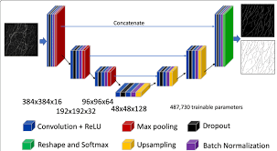

# UNET IMAGE SEGMENTATION
Image segmentation is to a technique to understand the scene using deep learning. In additon, UNET is a neural network architecture that makes pixel-by-pixel predictions reducing and increasing the size of image.

**You can download the dataset using this drive link:** [Drive Link](https://drive.google.com/file/d/1Ty-RW_BWYqzanvGBGYWIMXU_dkjCLzwu/view?usp=sharing)

📺 **You can watch our videos in Youtube:** [YouTube Link](https://youtu.be/xvXsnyDzLlo?si=4APgFBBR7tfVYsWi)
